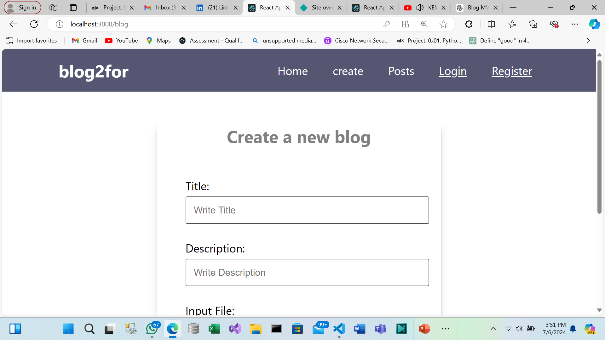

# Blog2For

## Introduction

**Blog2For** is a modern and user-friendly blogging platform that allows users to easily create, share, and manage their blog posts. This project was developed as a part of my ALX portfolio to demonstrate my full-stack development skills. The platform is built using React for the frontend, Node.js and Express for the backend, and MongoDB for data storage. 

### Links
- **Deployed Site:** [Visit Blog2For](https://prismatic-pavlova-3f8abb.netlify.app/)
- **Final Project Blog Article:** [Read the Blog Post](https://medium.com/@osikilemmy/blog2for-is-a-blogging-platform-designed-to-make-creating-and-managing-blog-posts-easy-0ddea85dfacf)
- **Author LinkedIn:** [Victory's LinkedIn](https://www.linkedin.com/in/lemmy-osiki-b6934418b//)

## Installation

To run the Blog2For project locally, follow these steps:

1. Clone the repository:
    ```bash
    git clone https://github.com/Lemmy731/MyApp.git
    ```
2. Navigate into the project directory:
    ```bash
    cd MyApp
    ```
3. Install backend dependencies:
    ```bash
    cd backend
    npm install
    ```
4. Install frontend dependencies:
    ```bash
    cd ../frontend
    npm install
    ```
5. Set up environment variables:
    - Create a `.env` file in the backend directory with the following variables:
        ```
        MONGODB_URI=your_mongodb_uri
        JWT_SECRET=your_jwt_secret
        ```
6. Start the development servers:
    - For the backend:
        ```bash
        cd backend
        npm start
        ```
    - For the frontend:
        ```bash
        cd ../frontend
        npm start
        ```

## Usage

Once the servers are running, you can access the application by navigating to `http://localhost:3000` in your web browser. Users can register for an account, log in, and start creating blog posts.

## Contributing

Contributions are welcome! Please follow these steps to contribute:

1. Fork the repository.
2. Create a new branch for your feature or bug fix:
    ```bash
    git checkout -b feature/your-feature-name
    ```
3. Make your changes and commit them:
    ```bash
    git commit -m "Description of changes"
    ```
4. Push to the branch:
    ```bash
    git push origin feature/your-feature-name
    ```
5. Create a pull request.

## Related Projects

(https://github.com/Lemmy731/HotelManagementSystem-FrontEnd.git) - Description of related project.

## Screenshot

Here is a screenshot of the Blog2For application:




